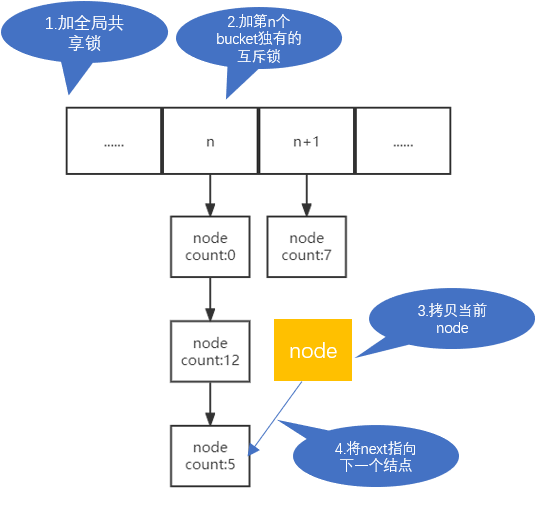
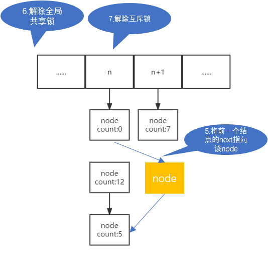
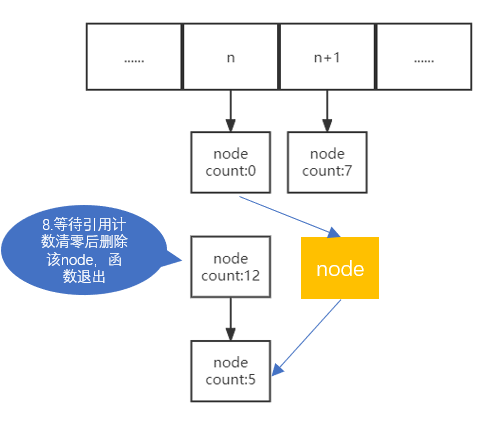
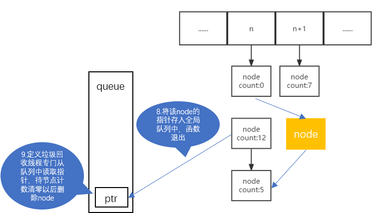

# 基于RCU的unordered_map

**unordere_map底层的hash map添加了自定义的RCU锁，在并发读写情况下，实现了读不加锁的线程安全模式，在读的次数远大于写的次数（读的频率占总频率的90%）的情况下效率会很高。**

## 成员函数

**构造函数**

| 参数类型  | 默认值       | 功能                                                   |
| --------- | ------------ | ------------------------------------------------------ |
| std::size | 12289ul      | 初始化哈希表长度                                       |
| enum      | SYN_RECOVERY | SYN_RECOVERY: 同步回收垃圾；ASY_RECOVERY: 异步回收垃圾 |

```c++
/**
* @brief 查找
*
* @param key 键
* @return iterator 迭代器
*/
iterator find(const __Key& key);

/**
* @brief 删除
*
* @param key 键
*/
void erase(const __Key& key);

/**
* @brief 更新或添加
*
* @param key 键
* @param value 值
*/
void update(const __Key& key, const __T& value);

/**
* @brief 添加
*
* @param key 键
* @param value 值
*/
void insert(const __Key& key, const __T& value);
```

## **RCU的实现细节**

**读**

每当迭代器访问到开链哈希表的某个节点时，该节点的引用计数+1；每当迭代器从该节点离开时，该节点的引用计数-1。

**写**（以更新为例）

哈希表有n个bucket，就有n个写互斥锁，通过这种方式，使得并行写操作时，对不同的链表可进行并行修改，但是一个链表最多只能有一个线程进行写操作。

每次写时给整个哈希表添加共享锁，所有写的线程（访问同一个链表除外）互不干涉，当哈希表要扩容时，给整个哈希表添加排他锁，阻塞所有的写线程来进行线程安全地扩容。





第6步以后，将对node进行delete，在这里有两种delete方式：

同步垃圾回收：



异步垃圾回收：




